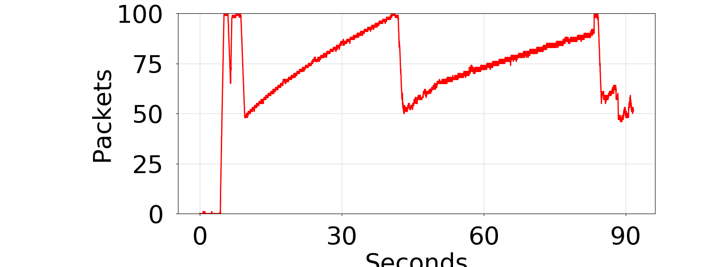
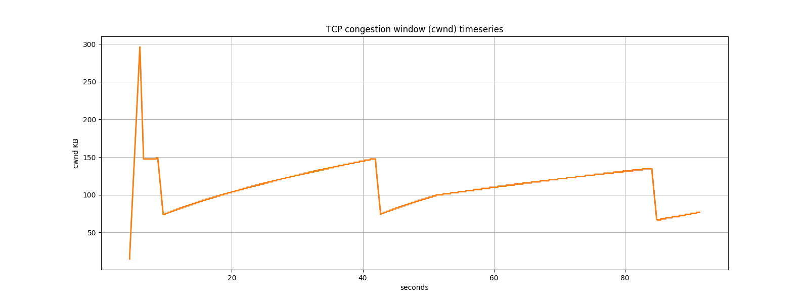
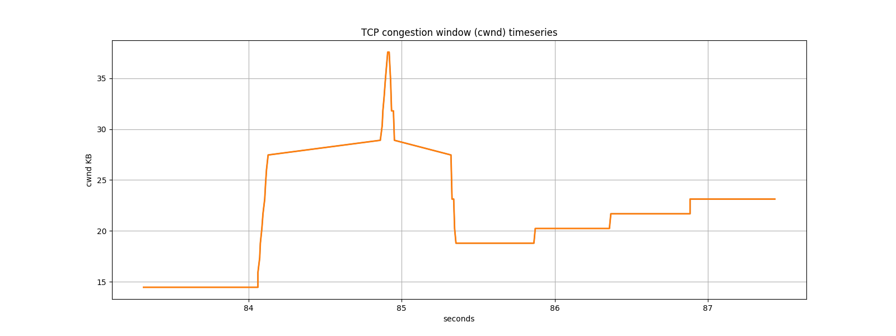
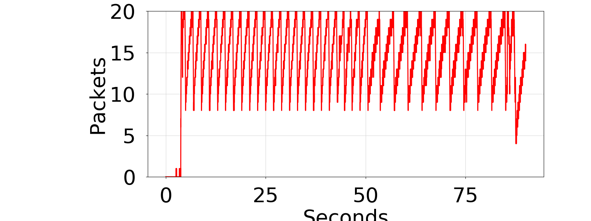
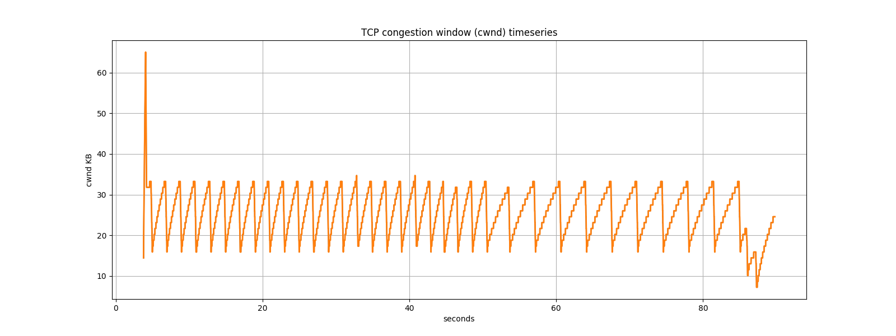
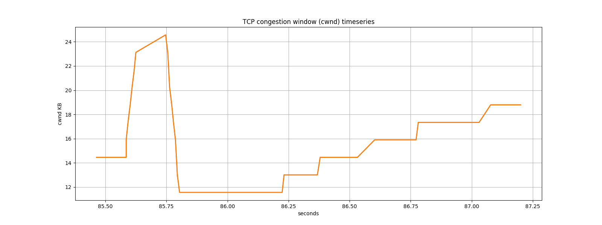

# SUTD 2021 50.012 Lab 4 Writeup Submission Document

> James Raphael Tiovalen / 1004555

## Initial Setup Questions

IP address of `h1`: `10.0.0.1`

IP address of `h2`: `10.0.0.2`

## Submission Questions

1. What is the normal time required to download the webpage on `h1` from `h2`?

   About 1 second with `qlen` 100, and around 1.5 seconds with `qlen` 20.

2. What was your initial expectation for the congestion window size over time?

   The congestion window size should exponentially increase in the initial slow start phase, before performing and undergoing the AIMD technique/algorithm as the network becomes more congested as more data packets are being transferred. This is the expected "normal" behavior based on the TCP Reno specifications. For a short bursty flow of data, we might expect that the congestion window size's behavior simply follows only the slow state and never reaching the congestion avoidance state as the connection ends/closes before it ever reaches that state, while for a long-established and long-lived connection, the congestion window size might even go through several rounds of AIMD before termination of the connection.

3. After starting `iperf` on `h1`, did you observe something interesting in the ping RTT?

   The ping RTT kept slowly increasing for a while, before rapidly decreasing in a short period of time. This sequence cyclically repeats over time. In general, the ping RTT is much larger as compared to when there is no `iperf` running in the background. Comparing between `qlen` 100 and `qlen` 20, the ping RTT is about the same when there is no `iperf`, while the ping RTT for `qlen` 100 is much higher than for `qlen` 20 when there is `iperf` running.

4. After starting `iperf` on `h1`, why does the web page take so much longer to download?

   This is because of parallel, multiple connections that need to be maintained in the network. Since the long-lived video streaming network takes up a significant portion of the bandwidth, and since the total overall bandwidth is being shared with `iperf`, the effective bandwidth available to use for downloading the file became smaller, and thus the download speed became slower. Hence, it takes a longer time to download the same file with the same size. This is applicable for both sizes/lengths of `qlen` (both 100 and 20).

5. Figures for the first experiment (with `qlen` 100):

   

   

   

   Initially, the TCP congestion control started in the slow start state, before experiencing some packet loss/timeout events that led to it transitioning to the congestion avoidance state until the download is complete. This is expected behavior, following TCP Reno's design specifications. The stable value of `ssthresh` in the long run (after every loss event) seems to be around 75 KB.

6. Figures for the second experiment (with `qlen` 20):

   

   

   

   Similar to the first experiment, the TCP congestion control also started in the slow start state and then transitioning to the congestion avoidance state. The difference is that when `qlen` is 20, it takes a shorter time to fill up the buffer entirely, resulting in very frequent phases of the AIMD behavior. The stable value of `ssthresh` in the long run (after every loss event) seems to be around 16 KB, which is smaller compared to when `qlen` is 100. As for the queue, it also gets filled up very quickly, before it decreased in half.

   When the queue length is smaller, the network seems to experience less packet loss. `iperf` experiences multiplicative decrease more often when `qlen` is smaller, which will result in more opportunities to achieve fairness, allowing `wget` to get a more significant share of the bandwidth. In contrast, if the `qlen` is larger, the buffer will take a longer time to "drain" (and hence it will take a longer time to reset the TCP congestion control). This excess buffering of packets will ultimately result in more jitter, less effective throughput ("goodput"), and high (and more variable) latency due to packets from `iperf` choking the network bottlenecks and filling up the buffers with only packets from `iperf` and hence, dropping most of/all the other packets from any other (types of) traffic (including the `wget` packets). In essence, when buffer overflow occurs, it is experienced less fairly by packets from all sources of traffic when the queue/buffer size is larger. This phenomenon is also known as bufferbloat.

