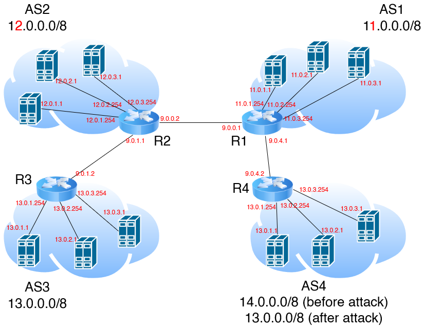

# SUTD 2021 50.012 Lab 5 Writeup Submission Document

> Project Group 2 Members:
>
> - James Raphael Tiovalen / 1004555
> - Velusamy Sathiakumar Ragul Balaji / 1004101
> - Han Xing Yi / 1004330
> - Huang He / 1004561
> - Qiao Yingjie / 1004514
> - Zhang Peiyuan / 1004539

## Submission Answers

### Topology

IP addresses of all routers:

<table style="margin-left:auto;margin-right:auto;">
<thead>
<tr>
<th align="center">Router</th>
<th align="center">Interface</th>
<th align="center">IP Address</th>
</tr>
</thead>
<tbody>
<tr>
<td align="center" rowspan="5">R1</td>
<td align="center">R1-eth1</td>
<td align="center">11.0.1.254</td>
</tr>
<tr>
<td align="center">R1-eth2</td>
<td align="center">11.0.2.254</td>
</tr>
<tr>
<td align="center">R1-eth3</td>
<td align="center">11.0.3.254</td>
</tr>
<tr>
<td align="center">R1-eth4</td>
<td align="center">9.0.0.1</td>
</tr>
<tr>
<td align="center">R1-eth5</td>
<td align="center">9.0.4.1</td>
</tr>
<tr>
<td align="center" rowspan="5">R2</td>
<td align="center">R2-eth1</td>
<td align="center">12.0.1.254</td>
</tr>
<tr>
<td align="center">R2-eth2</td>
<td align="center">12.0.2.254</td>
</tr>
<tr>
<td align="center">R2-eth3</td>
<td align="center">12.0.3.254</td>
</tr>
<tr>
<td align="center">R2-eth4</td>
<td align="center">9.0.0.2</td>
</tr>
<tr>
<td align="center">R2-eth5</td>
<td align="center">9.0.1.1</td>
</tr>
<tr>
<td align="center" rowspan="5">R3</td>
<td align="center">R3-eth1</td>
<td align="center">13.0.1.254</td>
</tr>
<tr>
<td align="center">R3-eth2</td>
<td align="center">13.0.2.254</td>
</tr>
<tr>
<td align="center">R3-eth3</td>
<td align="center">13.0.3.254</td>
</tr>
<tr>
<td align="center">R3-eth4</td>
<td align="center">9.0.1.2</td>
</tr>
</tbody>
</table>

Hosts/IPs in the ASes:

<table style="margin-left:auto;margin-right:auto;">
<thead>
<tr>
<th align="center">AS</th>
<th align="center">Host</th>
<th align="center">Interface</th>
<th align="center">IP Address</th>
</tr>
</thead>
<tbody>
<tr>
<td align="center" rowspan="3">AS1</td>
<td align="center">h11</td>
<td align="center">h11-eth0</td>
<td align="center">11.0.1.1</td>
</tr>
<tr>
<td align="center">h12</td>
<td align="center">h12-eth0</td>
<td align="center">11.0.2.1</td>
</tr>
<tr>
<td align="center">h13</td>
<td align="center">h13-eth0</td>
<td align="center">11.0.3.1</td>
</tr>
<tr>
<td align="center" rowspan="3">AS2</td>
<td align="center">h21</td>
<td align="center">h21-eth0</td>
<td align="center">12.0.1.1</td>
</tr>
<tr>
<td align="center">h22</td>
<td align="center">h22-eth0</td>
<td align="center">12.0.2.1</td>
</tr>
<tr>
<td align="center">h23</td>
<td align="center">h23-eth0</td>
<td align="center">12.0.3.1</td>
</tr>
<tr>
<td align="center" rowspan="3">AS3</td>
<td align="center">h31</td>
<td align="center">h31-eth0</td>
<td align="center">13.0.1.1</td>
</tr>
<tr>
<td align="center">h32</td>
<td align="center">h32-eth0</td>
<td align="center">13.0.2.1</td>
</tr>
<tr>
<td align="center">h33</td>
<td align="center">h33-eth0</td>
<td align="center">13.0.3.1</td>
</tr>
</tbody>
</table>

Topology Diagram:

### BGP Traffic

Before the `clear bgp external` command was executed, according to the Wireshark packet capture log on the `R1-eth4` interface, there is a constant stream of bidirectional BGP KEEPALIVE and TCP packets being periodically sent between `9.0.0.1` and `9.0.0.2`. After the `clear bgp external` command was executed on router R1, the occasional sending of BGP KEEPALIVE and TCP packets were stopped completely for a few seconds. Then, special BGP NOTIFICATION and BGP OPEN message packets were transmitted from `9.0.0.1` to `9.0.0.2` and back, and BGP UPDATE packets were sent between `9.0.1.1` and `9.0.1.2`, after which, the BGP connection was re-established and the occasional normal stream of BGP KEEPALIVE and TCP packets resume.

During the period whereby the BGP KEEPALIVE packets were not being sent, h11 was unable to reach h31 (`13.0.1.1`) and h33 (`13.0.3.1`) (which can be checked by executing the `h11 ping h31` and `h11 ping h33` commands on the Mininet console and which would print `Destination Net Unreachable` log messages). When the stream of BGP KEEPALIVE exchange packets resume, h11 was able to reach both h31 and h33 again. The connection between the hosts was temporarily lost when the routes were cleared because without the BGP protocol advertising the path to hosts located in other ASes, the BGP routing would not be set up and thus any hosts in AS1 would not be able to reach any hosts in AS3, and vice versa.

Throughout the BGP route traffic re-establishment process, R1 was not able to reach h31 and h33 (which can be checked by executing the `R1 ping h31` and `R1 ping h33` commands on the Mininet console). During the period whereby BGP KEEPALIVE packets were not being sent, a `Network is unreachable` error message was displayed, whereas during the normal period whereby BGP KEEPALIVE packets were sent, the console was simply stuck after executing the `R1 ping h31` and `R1 ping h33` commands without any output being returned.

To fix this, we add the line `network 9.0.0.0/8` to the `bgpd-R2.conf` BGP configuration file. After this modification, both h11 and R1 are now able to reach both h31 and h33 by running the aforementioned `ping` commands.

Initially, before the fix, h11 was able to reach h31 and h33, but R1 was not able to reach h31 and h33. h11 could reach h31 and h33 because R3 advertises AS3's subnet (`13.0.0.0/8`) to its neighbor R2 and R2 advertises this fact to R1. Thus, all hosts in AS1 can reach all hosts in AS3. In fact, since all gateway routers advertise their AS's corresponding subnet to their neighbors, any host in any AS can reach any host in any other AS.

However, R1 cannot reach h31 and h33 because R1's IP addresses are not considered to be part of AS1's hosts. R1's network interfaces are links to the hosts in AS1, but these interfaces (`R1-eth1`, `R1-eth2`, `R1-eth3`) are not hosts themselves.

In order for R1 to be able to reach h31 and h33 (or any host in AS3, for that matter), R2 has to advertise that it can reach both routers as hosts. This can be done by adding the `9.0.0.0/8` subnet to R2's advertisement messages, so that the BGP protocol will recognize `R1-eth4` and `R3-eth4` as hosts that can be reached. Once this is added, hosts in AS3 can reach R1 and hosts in AS1 can reach R3.

### BGP Attack
